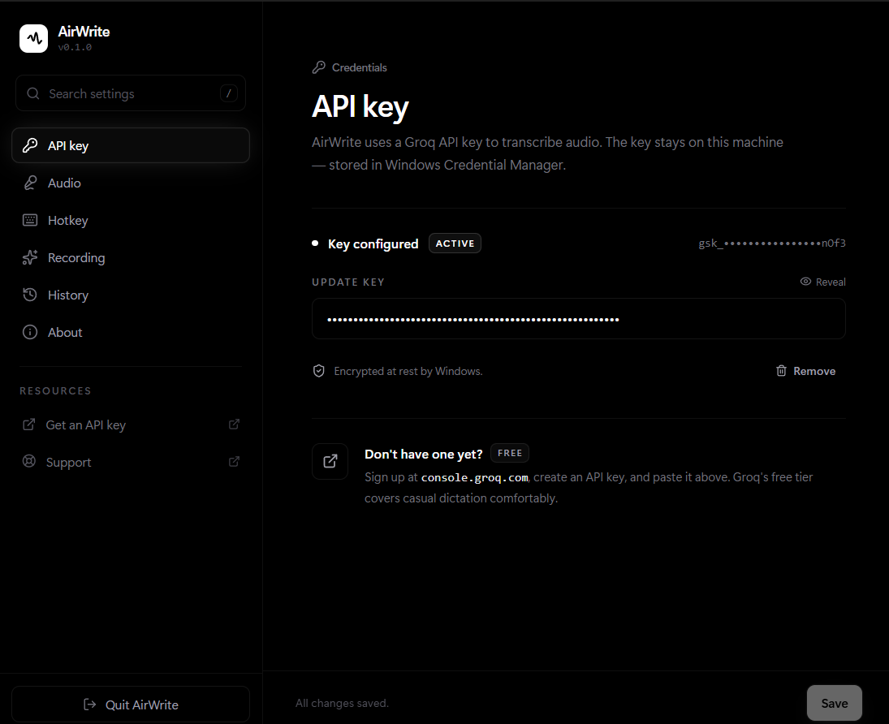
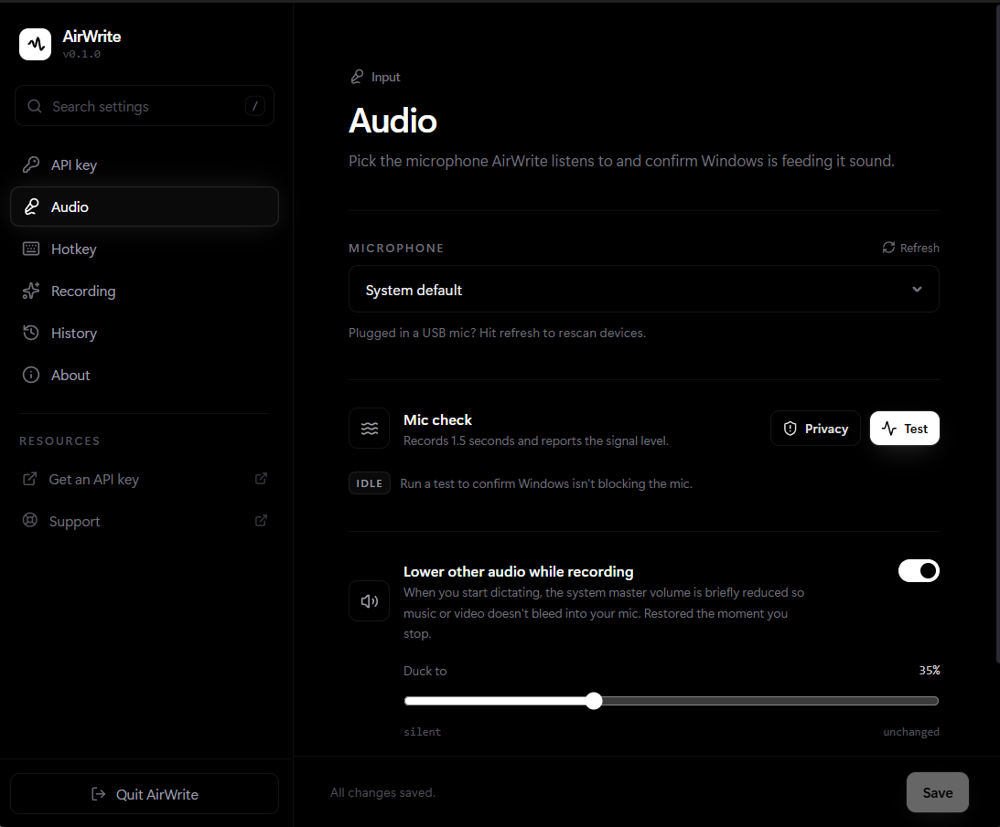
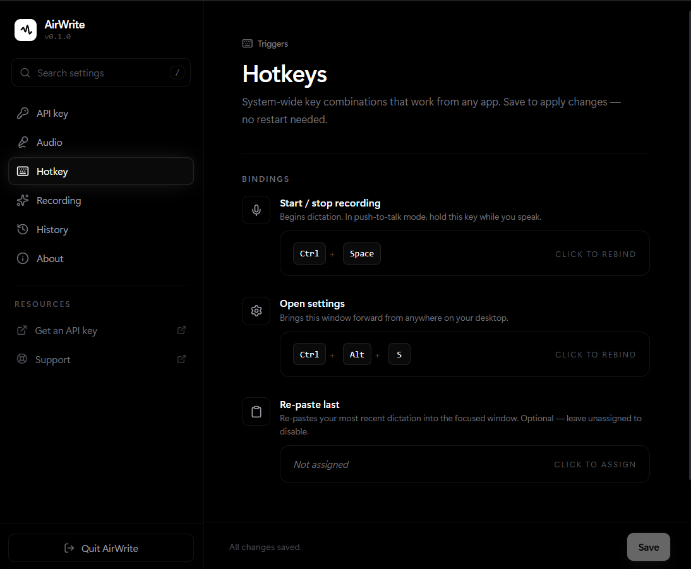
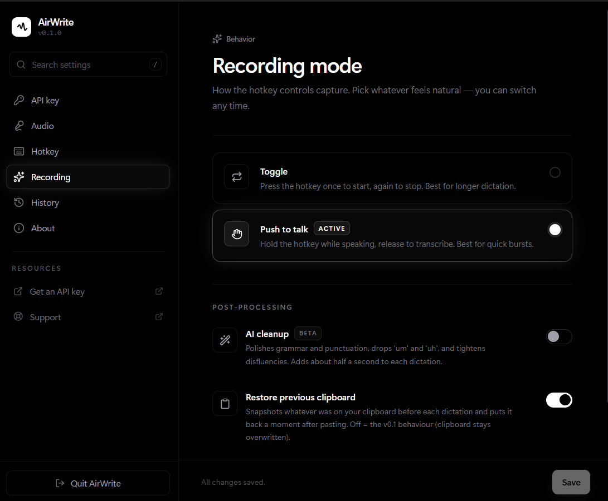
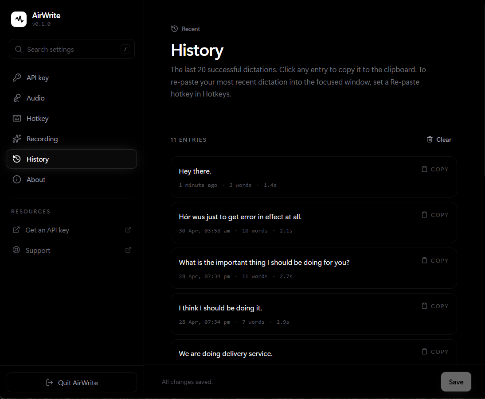

# AirWrite

AirWrite is a Windows desktop dictation app that lets you speak from anywhere on your system and paste the transcription directly into the focused app.

It runs in the background, listens for a global hotkey, records from your selected microphone, sends the audio to Groq Whisper for transcription, cleans up the text locally (and optionally via LLM), and pastes the result with `Ctrl+V`.

## Platform

AirWrite currently supports Windows only.

## What It Does

- **Global hotkey dictation** from any app — default `Ctrl+Shift+Space`
- **Toggle and push-to-talk recording modes** — toggle starts/stops on successive presses; push-to-talk records while the key is held
- **On-screen overlay pill** — floats at the top of your screen and shows recording, transcribing, pasted, and error states
- **F9 mic mute/unmute** — fixed hotkey that toggles Windows microphone mute with an overlay confirmation; not user-configurable
- **Local text cleanup** — capitalises the first letter and ensures a punctuation mark at the end
- **Optional AI cleanup** — sends the transcription to Groq (llama-3.3-70b-versatile) to fix grammar, punctuation, and remove filler words
- **Audio ducking** — lowers the system output volume while recording and restores it afterwards
- **Recording capped at 5 minutes** — bounds the in-memory buffer and prevents Groq HTTP 413 errors
- **Microphone picker** with a built-in mic test
- **Groq API key storage** through Windows Credential Manager — never written to `config.json`
- **Configurable hotkeys** for recording, opening settings, and re-pasting the latest transcript
- **History** — keeps up to 20 recent transcriptions; supports re-paste of the latest entry
- **Optional clipboard restore** — puts your prior clipboard contents back after pasting

## Default Hotkeys

| Action | Default |
|---|---|
| Start / stop recording | `Ctrl+Shift+Space` |
| Open / hide settings | `Ctrl+Alt+S` |
| Re-paste last transcript | _(unset — configure in Settings)_ |
| Mute / unmute mic (Windows) | `F9` (fixed) |

## Screenshots

### API Key



### Audio



### Hotkeys



### Recording



### History



## How It Works

1. Add your Groq API key in Settings.
2. Choose the microphone AirWrite should use (or run the mic test).
3. Press the recording hotkey (`Ctrl+Shift+Space` by default) from anywhere in Windows.
4. Speak.
5. Press the hotkey again (toggle mode) or release it (push-to-talk mode).
6. AirWrite transcribes the audio, cleans it up, and pastes the text into the focused window.

## Setup

### Prerequisites

- Windows
- Node.js 18+
- Rust
- A Groq API key

### Run In Development

```powershell
npm install
npm run tauri dev
```

### Build

```powershell
npm run tauri build
```

Tauri build outputs Windows installers such as:

- `src-tauri/target/release/bundle/nsis/AirWrite_0.1.0_x64-setup.exe`
- `src-tauri/target/release/bundle/msi/AirWrite_0.1.0_x64_en-US.msi`

## Privacy

- Your Groq API key is stored in Windows Credential Manager — never in `config.json`.
- AirWrite records locally, then sends the captured audio to Groq Whisper for transcription.
- If AI cleanup is enabled, the transcribed text is also sent to Groq (llama-3.3-70b-versatile).
- Recent transcription history (up to 20 entries) is stored locally on your machine.

## Tech Stack

- Tauri 2
- Rust
- React 18
- Vite
- Tailwind CSS 4
- Groq Whisper (transcription)
- Groq llama-3.3-70b-versatile (optional AI cleanup)

## Status

AirWrite is an early Windows-only desktop app and is still evolving.
